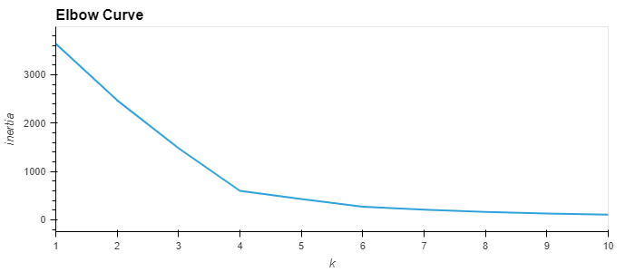
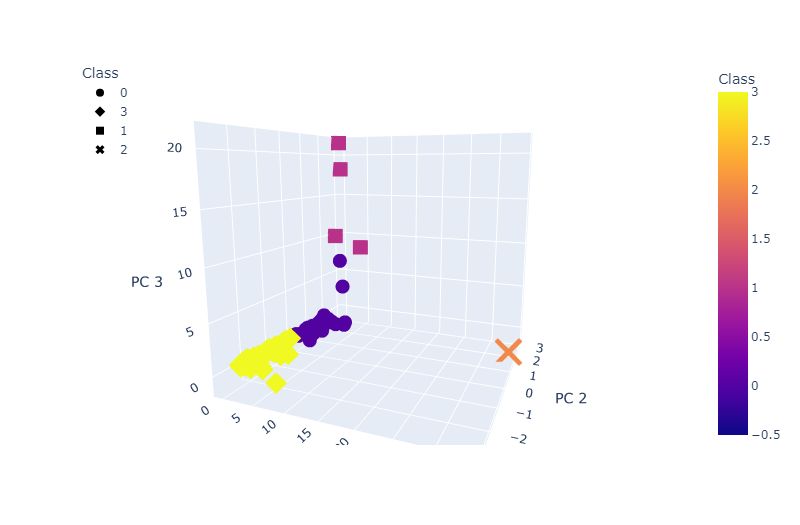
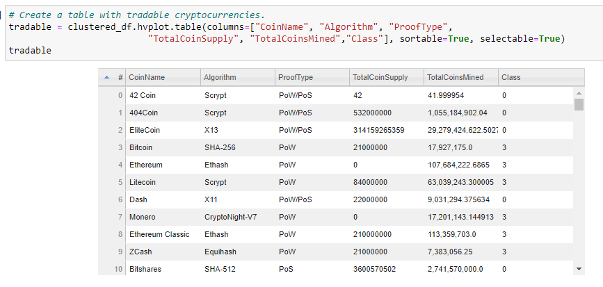
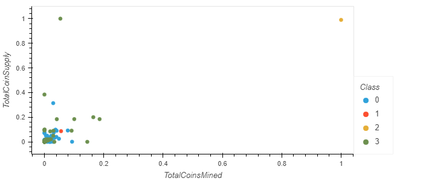

# Cryptocurrencies

## Project Overview

Martha, is a senior manager for Accountability Accounting, one of my most important clients. She informed me that Accountability Accounting is interested in offering cryptocurrency as an investment portfolio to consumers. So she has asked me to create a report that includes what cryptocurrencies are currently trading on the market and how they can be grouped to create a classification system. We have used unsupervised machine learning since there is no known output for what we are looking for.

## Resources
- **Data Source**: LoanStats_2019Q1.csv
- **Languages**: Python 3.7.6, Jupyter Notebook, Pandas
- **Software**: Atom 1.63.1, Visual Studio Code 1.74.1

## Results

> This shows us that 4 is the best K value.

> An image of the 3D plot of the 3 clusters

> An image of the interactive table of tradable cryptocurrencies.

> Scatter plot displaying the total coin supply versus total coins mined.

## Summary

Through the analysis we found there are currently 532 tradable cryptocurrencies, across three classes.
